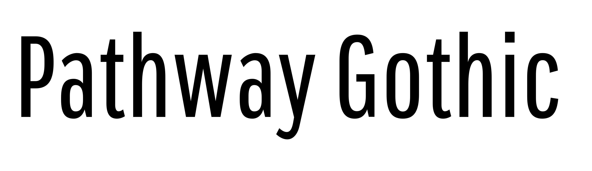
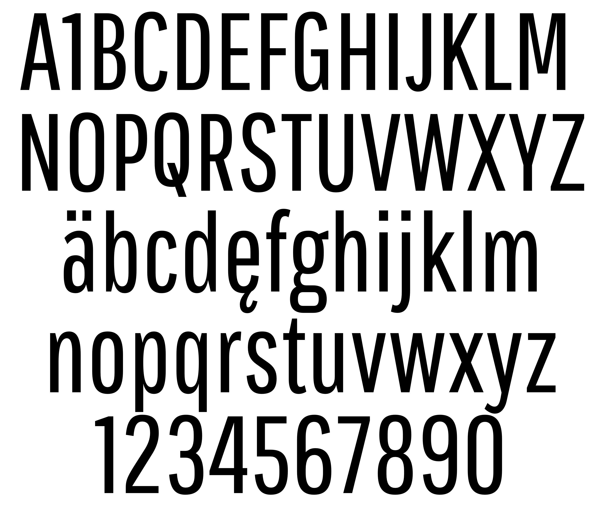

### Pathway Gothic

Pathway Gothic One is a narrow grotesque sans typeface, a very popular style in the history of typography. This book weight is the first of many.

### Designer

* Eduardo Rodríguez Tunni

### License

Licensed under the [*SIL Open Font License, 1.1*](http://scripts.sil.org/OFL); you may not use this file except in compliance with the License.

To contribute to the project contact Eduardo Rodríguez Tunni > edu@tipo.net.ar
